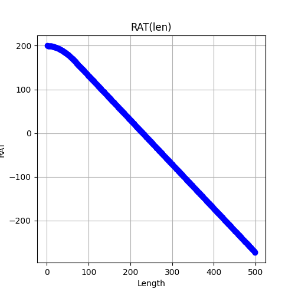
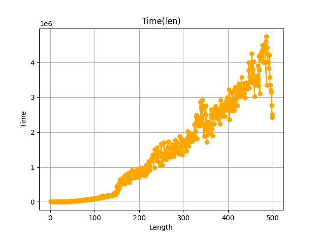

# Buffer Insert Van Ginneken Algorithm
This is a simple implementation of buffer inserting algorithm.

## Build
To build program:
```
        git clone https://github.com/kefirRzevo/BufferInsertAlgorithm.git
        cd BufferInsertAlgorithm
        cmake -S . -B build
        cmake --build build
```

## Results

Plot RAT(Length):



Plot Time(Length):



Results are nice.
