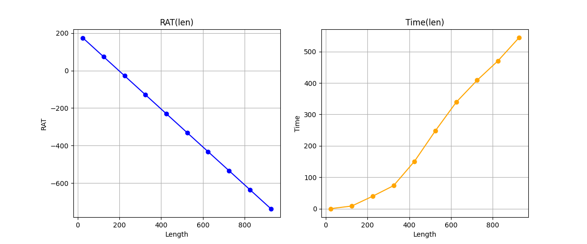

# Buffer Insert Van Ginneken Algorithm
This is a simple implementation of buffer inserting algorithm.

## Build
To build program:
```
        git clone https://github.com/kefirRzevo/BufferInsertAlgorithm.git
        cd BufferInsertAlgorithm
        cmake -S . -B build
        cmake --build build
```
To enable logging, run `cmake -DCMAKE_BUILD_TYPE=Debug -S . -B build`.

## Results

To make measurements for a single point situation, you can use the script
`analysis/Analysis.py`. It will build the required graphs in the `res` folder.
If you changed any parameters in tech file, you can run
`analysis/UpdateResults.py` to update tests results in `results` directory.


